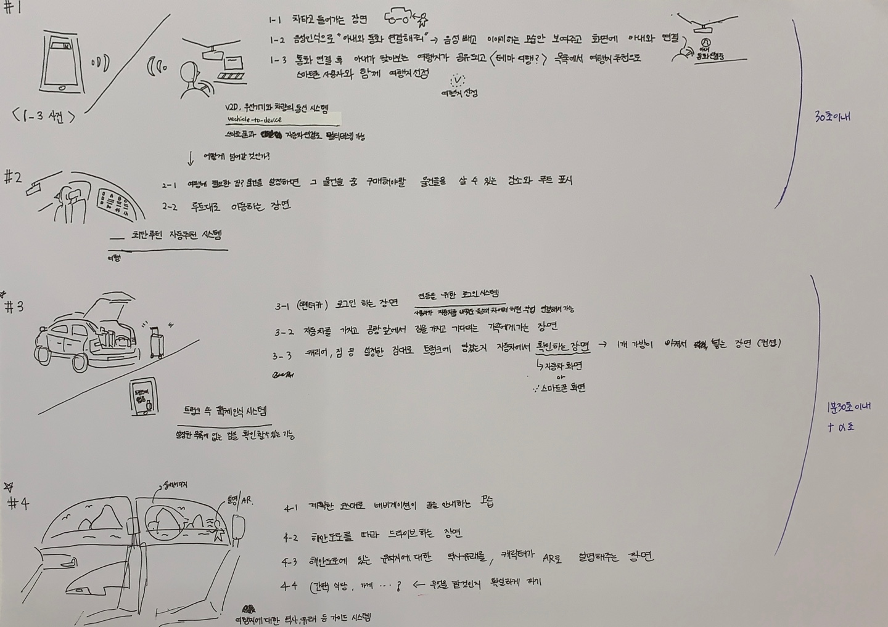
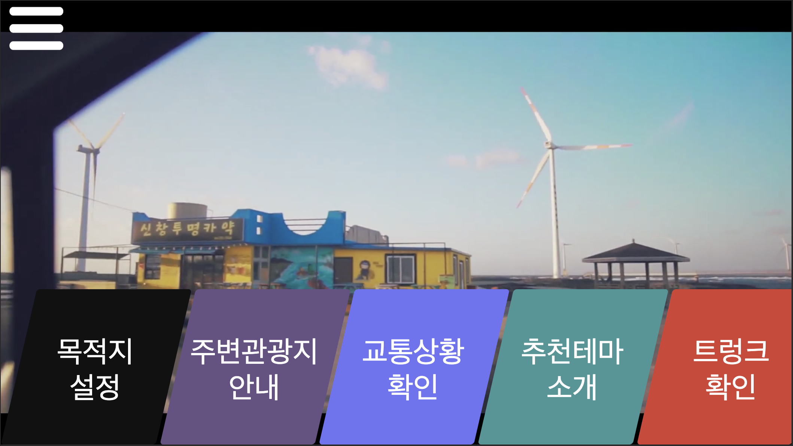

# HYMEC_EBSW_ConnectedCar

제 18회 임베디드 소프트웨어 경진대회 제출 및 프로젝트 관리를 위한 페이지입니다

This is repository for 18th Embedded Software Contest webOS part

[한국어로 보기](./korean/README.md)

## Our Goal

Make **Connected Window** to get information happily

## Scinario

[답사](https://www.notion.so/hyuncello/5766916165ca437497203504cc41a0ee)

#1 가족끼리 제주도 여행을 가기 위해 계획을 세우는 장면

#2 휴대폰으로 세운 여행 계획이 자동차와 연동 되면서 필요한 구매 목록 추천

#3 장을 본 후 트렁크에 짐이 실리고 객체인식을 이용한 트렁크 내의 물건 파악, 제주도로 여행을 떠나서 렌트 카를 빌려, 로그인 하면 그 전에 자동차에 했던 시스템 전체 연동 되면서 제주도 여행 코스를 알려주는 시스템

#4 해안도로를 달리면서 해안가에 있는 섬들의 유래를 알려주는 AR시스템 + 관광지에 대한 정보 전달(혼잡도, 입장 요금  등등)

#5 여행 마무리, 렌터카 반납시간 알려주는 기능 등등 렌터카 반납

## Develop points

- [o] 지도에 목적지 및 소요시간 표시
- [o] 가고자 하는 장소의 혼잡도 안내 (도로 혼잡상황 이용)
- [ ] AR 콘텐츠를 이용한 효과적인 주변 정보 표현
- [ ] 목적지 주변의 장소의 정보들을 다양한 테마에 맞게 제공
- [ ] 객채인식을 이용한 주변 견광의 정보 제공
- [ ] 객채인식을 이용한 트렁크 내 물체 확인

## Functions

1. Window Display

   

2. AR contents
3. Using POI
4. Inform Congestion about each POI
5. Show trunk stuffs

## Effects

- People that in car can get information about their intrests with AR contents
- 

## Hardware Used

- Nvidia Jetson Nano
- Raspberrypi4
- 15.6" touch display \* 2
- Logitech C920r \* 2

## Software Used

- ROS integrated webOS
- webApp for webOS
- LS2 API for webOS
- Naver Map API
- ROS
- Google Cloud Platform
