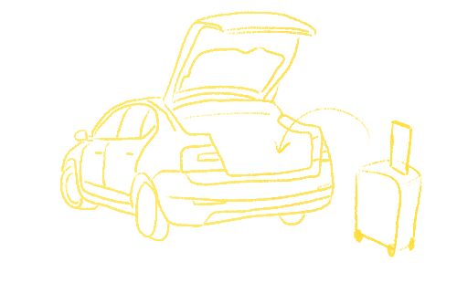

# HYMEC_EBSW_ConnectedCar

제 18회 임베디드 소프트웨어 경진대회 제출 및 프로젝트 관리를 위한 페이지입니다

This is repository for 18th Embedded Software Contest

[See English](../README.md)

## 개발 목표

Make **Connected Window** to get information happily

## 기능들

1. Window Display

   

2. AR contents
3. Using POI
4. Inform Congestion about each POI
5. Show trunk stuffs

## 시나리오

One Family is going to Jeju Island for Family Vacation.

They reserved resorts and selected main view points, but didn't think about other sightseeings.

After arrived in Jeju Airport, they rent a car that have Connected Window System.

...

## 개발 포인트

- [ ] AR 콘텐츠를 이용한 효과적인 주변 정보 표현
- [ ] 객채인식을 이용한 주변 견광의 정보 제공
- [ ] 가고자 하는 장소의 혼잡도 안내 (도로 혼잡상황 이용)
- [ ] 목적지 주변의 장소의 정보들을 다양한 테마에 맞게 제공
- [ ] 객채인식을 이용한 트렁크 내 물체 확인

## 기대 효과

- People that in car can get information about their intrests with AR contents
-
